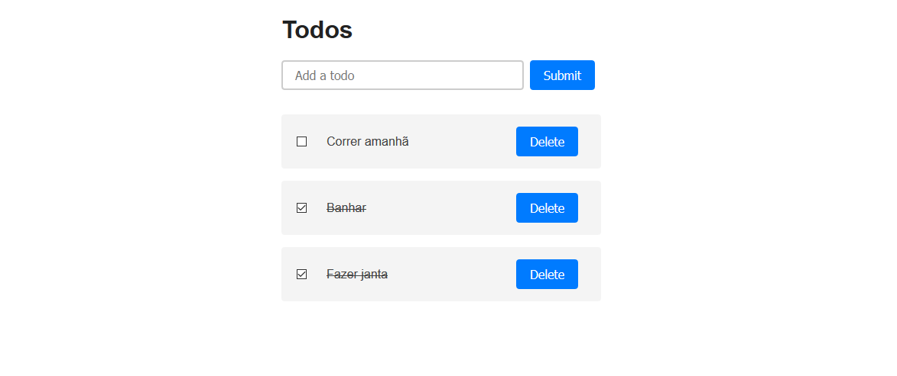

</img>

<h1  align="center">Tania Rascia's MVC Project</h1>

# About this project

So basically, i was searching for examples of MVC architecture with Javascript, and found <a  href="https://github.com/taniarascia">Tania Rascia</a> project on her website: <a  href="https://www.taniarascia.com/javascript-mvc-todo-app/">https://www.taniarascia.com/javascript-mvc-todo-app/</a>.

I believe she is a front-end developer, since her <a  href="https://github.com/taniarascia">Github</a> has a lot of front-end stuff. I don't know much about her, but seems to be that kind of developer who tries to help others, and that is appreciated. Thank you Tania.

# Modifications

I don't know much about MVC as well, but i got a little experience from another project **( you can find it on my repositories, it's called alura-frame. )** , and one thing that i kept on my mind after doing that project is that the controller is the one who does things, the view and the model shouldn't do anything unrelated to generating the view and controlling the data, respectively.

So i did that. In her project, the view is listening to events, on mine, the controller is the one who holds all those functions.

Again, i don't know much about MVC, but i did that anyway, and the project is running the same way as the original is.

Oh, and i'm using import/export .

# Running the project

Is a simple Vanilla Javascript project with a little Html and Css. Just download the files, and open **index.html**.
